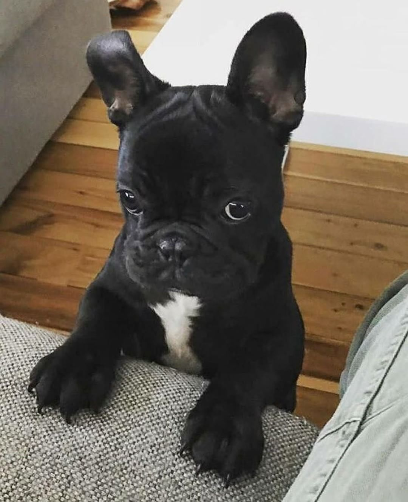

# GalleryMind - On-Device Semantic Gallery Search

<p>
  <a href="https://github.com/AMALAGU/gallery-mind/releases">
    
  </a>
  <a href="https://flutter.dev">
    
  </a>
  <a href="https://onnxruntime.ai">
    
  </a>
</p>

Offline semantic text-to-image and image-to-image search for your phone gallery.
GalleryMind indexes your photos on-device with a quantized OpenCLIP model, stores
embeddings locally, and lets you search your images with natural language.

<table>
  <tr>
    <td width="50%">
      
    </td>
    <td width="50%">
      
    </td>
  </tr>
  <tr>
    <td align="center"><sub>Placeholder image from this repository: <code>assets/images/img0.jpg</code>.</sub></td>
    <td align="center"><sub>Placeholder image from this repository: <code>assets/images/img8.jpg</code>.</sub></td>
  </tr>
</table>

> These images are temporary README placeholders and will be replaced with real
> GalleryMind screenshots/demo media later.

## Approach

GalleryMind follows the same general idea as
[TIDY - Text-to-Image Discovery](https://github.com/slavabarkov/tidy): use a
vision-language model to embed images and text into the same vector space, then
rank gallery images by cosine similarity.

The current GalleryMind build uses:

- **Model:** OpenCLIP `ViT-B/16`
- **Pretrained checkpoint:** `laion2b_s34b_b88k`
- **Source:** [laion/CLIP-ViT-B-16-laion2B-s34B-b88K](https://huggingface.co/laion/CLIP-ViT-B-16-laion2B-s34B-b88K)
- **Runtime:** Android ONNX Runtime
- **Storage:** Android SQLite embedding store
- **App stack:** Flutter UI with native Kotlin Android inference/indexing

The model encodes gallery images into 512-dimensional embeddings. Text queries
are embedded with the matching text encoder, then compared against the stored
image embeddings. Image-detail recommendations use image-to-image similarity.

|  |
|:--:|
| Image source: [OpenCLIP documentation](https://github.com/mlfoundations/open_clip). Original CLIP concept from [OpenAI CLIP](https://github.com/openai/CLIP). |

## Features and Usage

### First Launch

On first launch, GalleryMind requests photo access and begins building a private
visual index. The app indexes recent images first so the gallery becomes useful
quickly, then continues indexing the remaining library in the background. Search
quality improves as more images are processed.

After the first index is built, GalleryMind keeps the local database and only
needs to index newly added images later.

### Privacy and Security

GalleryMind is designed for local, on-device search. Your photos and embeddings
stay on the phone. The CLIP/OpenCLIP model runs locally through ONNX Runtime, and
the vector index is stored in local SQLite.

### Text-to-Image Search

Type a natural language query like:

```text
a black cat
a screenshot of a message
a funny meme
cars
```

GalleryMind embeds the query, compares it with indexed gallery embeddings, and
returns the closest visual matches. Filename matches are also shown separately,
so exact text matches and semantic matches can both be useful without being
mixed together.

### Image-to-Image Search

Open an image detail page to view visually similar images from your indexed
gallery. This uses the selected image embedding directly and ranks nearby images
above the configured similarity threshold.

### Progressive Indexing

The home screen displays a lightweight progress card while indexing is active.
Users can keep browsing, opening images, and searching while background indexing
continues.

## Current Android Model Assets

The bundled Android assets live in `assets/models/tidy/`:

- `visual_quant.onnx` - quantized OpenCLIP ViT-B/16 image encoder
- `textual_quant.onnx` - quantized Android-compatible OpenCLIP ViT-B/16 text encoder
- `vocab.json` and `merges.txt` - CLIP BPE tokenizer files

The conversion and quantization workflow is documented in:

```text
C:\Users\Chike\Downloads\smartgallery\clip-vit-b16-laion2b-s34b-b88k\export_quantize_openclip_vit_b16.ipynb
```

## Build

Requirements:

- Flutter SDK
- Android Studio / Android SDK
- Android device or emulator

Run:

```bash
flutter pub get
flutter analyze
flutter build apk --release
```

The release APK is generated at:

```text
build/app/outputs/flutter-apk/app-release.apk
```

## Credits and References

GalleryMind was inspired by:

- [TIDY - Text-to-Image Discovery](https://github.com/slavabarkov/tidy)
- [OpenCLIP](https://github.com/mlfoundations/open_clip)
- [OpenAI CLIP](https://github.com/openai/CLIP)
- [LAION-2B / LAION-5B](https://laion.ai/blog/laion-5b/)
- [ONNX Runtime](https://onnxruntime.ai/)
- [Hugging Face model card: CLIP ViT-B/16 LAION2B](https://huggingface.co/laion/CLIP-ViT-B-16-laion2B-s34B-b88K)

## Citation

If you are referencing the inspiration project, cite TIDY:

```bibtex
@Misc{tidy,
  title =        {TIDY (Text-to-Image Discovery): Offline Semantic Text-to-Image and Image-to-Image Search on Android Powered by the Vision-Language Pretrained CLIP Model.},
  author =       {Viacheslav Barkov},
  howpublished = {\url{https://github.com/slavabarkov/tidy}},
  year =         {2023}
}
```

